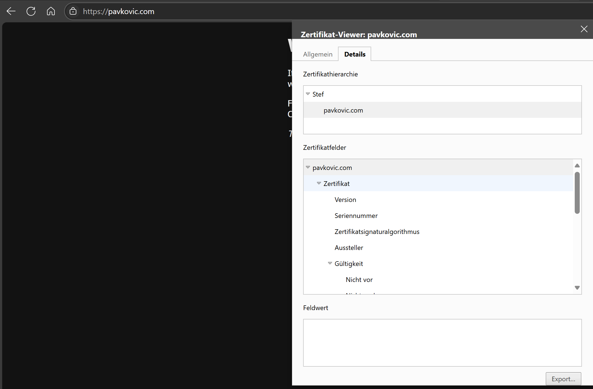

# Protokoll: Einrichtung eines lokalen HTTPS-Webservers mit eigener CA

## Ziel

Ein lokaler Webserver mit HTTPS-Verschlüsselung, betrieben mit einem selbstsignierten Zertifikat einer eigenen Certificate Authority (CA). Ziel ist es, sichere Verbindungen ohne externe Zertifikatsdienste zu ermöglichen.

---

## System

- Server: Ubuntu Server (VM oder lokal)
- Webserver: Nginx
- Client: Windows-PC mit Browser
- Server-IP: `192.168.221.231`
- Testdomain: `pavkovic.com`

---

## Schritte auf dem Ubuntu-Server

### 1. Ordnerstruktur anlegen

```bash
mkdir -p ~/myCA/server
cd ~/myCA
```

---

### 2. CA-Zertifikat erstellen

```bash
openssl genrsa -out myCA.key 4096
openssl req -x509 -new -nodes -key myCA.key -sha256 -days 3650 -out myCA.crt
```

Hinweis: `myCA.crt` ist die CA, die später in den Browser importiert wird.

---

### 3. Server-Key und CSR vorbereiten

```bash
cd ~/myCA/server
openssl genrsa -out server.key 2048
```

---

### 4. SAN-Konfigurationsdatei erstellen

```bash
nano san.cnf
```

Inhalt:

```ini
[ req ]
distinguished_name = req_distinguished_name
req_extensions = v3_req
prompt = no

[ req_distinguished_name ]
CN = pavkovic.com

[ v3_req ]
subjectAltName = @alt_names

[ alt_names ]
DNS.1 = pavkovic.com
IP.1 = 192.168.221.231
```

---

### 5. CSR (Zertifikatsanfrage) erstellen

```bash
openssl req -new -key server.key -out server.csr -config san.cnf
```

---

### 6. Zertifikat signieren

```bash
openssl x509 -req -in server.csr -CA ../myCA.crt -CAkey ../myCA.key -CAcreateserial \
-out server.crt -days 825 -sha256 -extfile san.cnf -extensions v3_req
```

---

## Nginx-Konfiguration (HTTPS)

```bash
sudo nano /etc/nginx/sites-available/default
```

Beispielkonfiguration:

```nginx
server {
    listen 443 ssl;
    server_name pavkovic.com;

    ssl_certificate     /home/stef/myCA/server/server.crt;
    ssl_certificate_key /home/stef/myCA/server/server.key;

    location / {
        root /var/www/html;
        index index.html;
    }
}
```

```Optionale Umleitung http --> https
server{
    server {
    listen 80;
    listen [::]:80;
    return 301 https://$host$request_uri;
}
```

Test und Reload:

```bash
sudo nginx -t
sudo systemctl reload nginx
```

---

## Windows-Client vorbereiten

### 1. hosts-Datei anpassen

Pfad: `C:\Windows\System32\drivers\etc\hosts`

```text
192.168.221.231   pavkovic.com
```

---

### 2. CA-Zertifikat (myCA.crt) importieren

1. Datei `myCA.crt` nach Windows kopieren
2. Doppelklick auf die Datei
3. "Zertifikat installieren"
4. Für "Lokalen Computer"
5. Speicherort: "Vertrauenswürdige Stammzertifizierungsstellen"

---

### 3. Im Browser testen

Aufruf im Browser:

```
https://pavkovic.com
```

Erwartetes Ergebnis:
- Keine Sicherheitswarnung
- Sichere Verbindung
- Aussteller ist die eigene CA

---

## Ergebnis

- Lokaler Webserver mit gültigem, selbstsigniertem Zertifikat
- Eigene CA wurde erfolgreich importiert
- HTTPS funktioniert ohne Zertifikatsfehler

### Bild
   